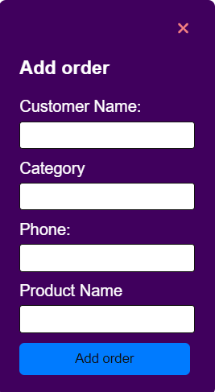

# REACT_PROJECT

# ERP System with React

This project endeavors to streamline the user experience of an ERP (Enterprise Resource Planning) system by leveraging React for its interface. The system encompasses essential functionalities such as product management, order processing, and a comprehensive dashboard overview. Moreover, an optional feature has been integrated to present orders through a calendar view.

## Project Overview

The ERP system consists of the following pages:

_**Dashboard:** Offers a consolidated view of pivotal metrics and functionalities, facilitating swift navigation to the Products and Orders management pages.

- **Products Management:** Facilitates the administration of product listings, encompassing capabilities to add, modify, and remove products with ease.

- **Orders Management:** Facilitates the viewing and management of orders, providing functionalities to inspect order details, update order statuses, add new orders, and remove existing orders effortlessly.

- **Orders Calendar View:** Implements a calendar view on the Orders Page, showcasing orders scheduled for delivery on their respective expected dates. Additionally, it offers the capability to review all orders slated for delivery on a designated day.

## Objectives

- Leverage the power of React to construct modular components, ensuring flexibility and reusability throughout the application.
- Employ React Router to seamlessly navigate between diverse sections of the ERP system, enhancing user accessibility and flow.
- Craft a responsive design that adapts seamlessly to various screen sizes, optimizing usability and experience across desktop 
  and mobile devices alike.

## Technology Stack

- React


### Running the Application

To run the application locally, follow these steps:

1. Clone the repository to your local machine:

   ```
   https://github.com/Pallavijadhav806/REACT_PROJECT
   ```

2. Navigate to the project directory:
    ```
    cd ERP-System
    ```

3. Install dependencies using npm:
    ```
    npm install
    ```

4. Start the development server:
   ```
   npm start
   ```
   
5. Open your browser and visit `http://localhost:3000` to view the application.

### Screenshots

*Figure 1: Dashboard overview*


*Figure 2: Products management page*


*Figure 3: Orders management page*




*Figure 4: Orders calendar view (optional feature)*


## Project Deployment

The project is deployed on [Netlify](https://react-erp-system.netlify.app/).

Happy coding!


